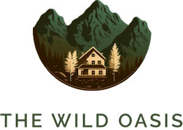

  

  
  
  
  
  
  
  
  
  
  
  
  
  

# The Wild Oasis

## Overview

This is the final frontend project from Jonas Schmedtmann's comprehensive React course: [The Ultimate React Course 2025: React, Next.js, Redux & More](https://www.udemy.com/course/the-ultimate-react-course/?couponCode=CP251118G4).

The Wild Oasis is a sophisticated hotel management application built with modern React practices and cutting-edge tools. Throughout this project, I'm documenting my learning journey comprehensively, including diagrams and detailed notes to serve as a valuable reference for future development.

## Learning Goals

This project focuses on mastering several advanced React concepts and tools:

- **Styled Components** - CSS-in-JS styling approach for component-based styling
- **React Router** - Client-side routing and navigation
- **React Query** - Server state management and data fetching
- **React Hook Form** - Performant form validation and handling
- **Advanced SPA Patterns** - Single Page Application architecture
- **Supabase** - Backend as a Service (BaaS) for database and authentication
- **React Design Patterns** - Compound components, render props, and more

## Documentation & Progress

All learning materials are organized into sections with detailed notes and examples:

| Section | Topics                                                                                    | Status         |
| ------- | ----------------------------------------------------------------------------------------- | -------------- |
| 1       | [Styled Components](./notes/01-styled-components/01-introduction-to-styled-components.md) | ✅ Completed   |
| 2       | [Supabase Crash Course](./notes/02-supabase/)                                             | ✅ Completed   |
| 3       | [React Query](./notes/03-react-query/)                                                    | ✅ Completed   |
| 4       | [React Patterns](./notes/04-react-patterns/)                                              | ✅ Completed   |
| 5       | [Additional Features](./notes/05-more-features/)                                          | ✍️ On progress |

## Tech Stack

- **React** - UI library
- **Styled Components** - Styling solution
- **React Router** - Routing
- **React Query (TanStack Query)** - Data fetching and caching
- **React Hook Form** - Form management
- **Supabase** - Backend services
- **Vite** - Build tool

## Key Learnings

- Using styled Components for styling HTML element in JavaScript
- Understanding basic supabase
- Implement CRUD using React query
- Form submition with React Hook Form
- Handling updload Photo to Supabase
- Abstracting React Query to useCustom Hooks
- React patttern components
- Reusable components with compound components pattern

### Currently Learning

- Setting up Styled Components
- Creating reusable styled component patterns
- Building a scalable component architecture

### Coming Soon

- Supabase integration
- Complex state management with React Query
- Advanced React patterns implementation

## Course Information

**Instructor**: Jonas Schmedtmann  
**Course**: The Ultimate React Course 2025  
**Platform**: Udemy

## 🙏 Acknowledgments

This project represents a significant milestone in my journey to master React development. My goal is to build a strong, deep understanding of modern React practices that will serve me throughout my career as a web developer.

I hope this repository becomes a valuable resource not only for my own learning but also for others on a similar journey.

## 🔜 What's Next?

After completing this project, I'll be moving on to:

- **Next.js** - Building production-ready React applications with server-side rendering

---

## Project Planning

### The wild oasis summary

- the wild oasis is a small boutique hotel with 8 luxurious wooden cabins
- they need a custom-build application to manage everything about the hotel: Booking, cabins and guest
- This is the internal application used inside the hotel to check in guest as they arrive
- They have nothing right now, so they also need the API
- later they will probably want a customer-facing website as well, where customers will be able to book stays, using the API

API

- Internals hotel management APP
- Customer

## Review: how to plan a react application

- Gather application requirements and features
- Divide the application into pages
- Divide the application into feature categories
- Decide on what libraries to use

### Authentication

- Users of the app are hotel employees. They need to be logged into the application to perform tasks
- New users can only be signed up inside the applications (to guarantee that only actual hotel employees can get accounts)
- Users should be able to , and change their name and password

### Cabins

- App needs a table view with all cabins, showing the cabin photo, name, capacity, price, and current discount
- Users should be able to update or delete a cabin, and to create new cabins (including uploading a photo)

### Bookings

- App needs a table view with all bookings, showing arrival and departure dates, status, and paid amount, as well as cabin and guest data
- The booking status can be “unconfirmed” (booked but not yet checked in), “checked in”, or “checked out”. The table should be filterable by this important status
- Other booking data includes: number of guests, number of nights, guest observations, whether they booked breakfast, breakfast price

### Check in/out

- Users should be able to delete, check in, or check out a booking as the guest arrives (no editing necessary for now)
- Bookings may not have been paid yet on guest arrival. Therefore, on check in, users need to accept payment (outside the app), and then confirm that payment has been received (inside the app)
- On check in, the guest should have the ability to add breakfast for the entire stay, if they had not already

### Guest

- Guest data should contain: full name, email, national ID, nationality, and a country flag for easy identification

### Dashboard

- The initial app screen should be a dashboard, to display important information for the last 7, 30, or 90 days:
- A list of guests checking in and out on the current day. Users should be able to perform these tasks from here
- Statistics on recent bookings, sales, check ins, and occupancy rate
- A chart showing all daily hotel sales, showing both “total” sales and “extras” sales (only breakfast at the moment)
- A chart showing statistics on stay duration, as this is an important metric for the hotel

### settings

- Users should be able to define a few application-wide settings: breakfast price, min and max nights/booking, max guests/booking
- App needs a dark mode

| Features Cateories | necessary pages                        |
| ------------------ | -------------------------------------- |
|                    | `dahboard`                             |
| Bookings           | `/bookings`                            |
| Cabins             | `/cabins`                              |
| Guests             |                                        |
| Dashboard          |                                        |
| Checkin Checkout   | `/checkin/:bookingID`                  |
| App Settings       | `/settings`                            |
| Authentication     | `/user`   `login`   `/account` |

## Client-side rendering (CSR) or Server-side rendering (SSR)

### CSR with plain react (VANILA REACT)

- Used to build Single-page Application (SPA's)
- All HTML is rendered on client
- All JavaScript needs to be downloaded before apps start running: bad performance
- One perfect use acse: apps that are used "internally" as tools inside companies, that are entirely hidden behind a login

### SSR With framework (NEXT.js / Remix)

- Used to build multi-page application (MPAs)
- Some HTML is rendered in the server
- More performance as less JavaScript needs to be downloaded
- The React team is moving more and more in this direction

## Tech Stack

- **Routing:** `React Router`, The standar for React SPAs
- **Styling**: `</img>styled components`, Very populer way of writig componet-scopped CSS, right inside Jacvascript. A techology worth learning
- **Remote state management:** `ReactQuery`, The best way of managing remote state, with features like caching, automatic re-fetching, offline support, etc.
- **UI State management:** `Context API`, there is almost no UI state needed in this app, so one simple context with useState will be enough. No need redx
- **Form menegement:** `React Hook Form`, Handling bigger forms can be a lot of work, such as maual satate creation and error handling . A library can cimplify all this
- **Otehrs tools:** `React icons`, `React hot toast`, `Recharts`, `date-fns`, `supabase`
